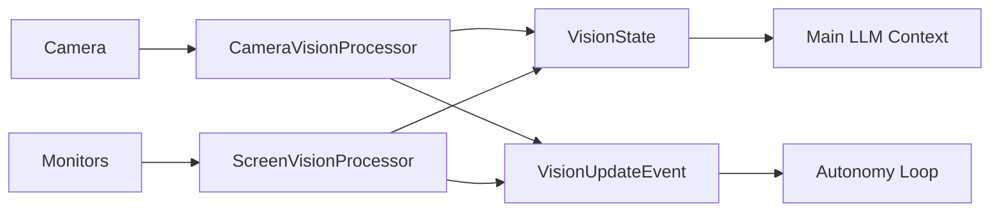

# GLaDOS Vision Module

GLaDOS vision is a local visual sensing layer. The main chatbot can remain a
text-only LLM: camera and screen processors convert pixels into short text
snapshots, then inject those snapshots into chat context.

## Role in Architecture

When enabled:

1. Camera and/or screen processors capture frames.
2. Low-resolution frame differencing detects meaningful changes.
3. FastVLM, or an OpenAI-compatible VLM server, generates compact descriptions.
4. `VisionUpdateEvent` triggers autonomy when a scene changes.
5. The main agent decides whether to speak, stay silent, remember, or call a
   fresh inspection tool.



Vision takes priority over timer ticks. If vision is enabled, scene changes
drive the autonomy loop instead of periodic timer ticks.

## Quick Start

The default config does not enable vision. Use the example config or add a
`vision:` block to your own config:

```bash
uv run glados start --config ./configs/glados_vision_config.yaml
```

## Configuration

```yaml
vision:
  model_dir: "models/Vision" # optional, defaults to bundled path
  camera:
    enabled: true
    camera_index: 0
    capture_interval_seconds: 5
    resolution: 384
    scene_change_threshold: 0.05
    max_tokens: 64
  screen:
    enabled: true
    backend: "mss"
    analyzer: "fastvlm"              # background watcher
    tool_analyzer: "openai_compatible" # screen_look only
    model: "bartowski/Qwen_Qwen3.5-4B-GGUF:Q4_K_M"
    completion_url: null
    tool_completion_url: "http://localhost:12331/v1/chat/completions"
    monitors: "all"
    thumbnail_interval_seconds: 1
    capture_interval_seconds: 5
    resolution: 384
    scene_change_threshold: 0.04
    max_tokens: 128
    request_timeout_seconds: 60
```

Legacy camera-only config is still supported:

```yaml
vision:
  camera_index: 0
  capture_interval_seconds: 5
```

## Context Injection

The vision system maintains keyed snapshots:

```text
[vision:camera] A person is sitting at a desk with headphones.
[vision:screen:monitor_1] VS Code is open with a terminal error.
[vision:screen:monitor_2] A browser page with documentation is visible.
```

These are system-context messages. The main LLM should treat them as passive
context, not user messages.

## Tools

Two separate tools are exposed when their sources are enabled:

```text
camera_look(prompt="Describe what the user is doing.")
screen_look(prompt="Read the visible error.", monitor="1")
```

`camera_look` captures a fresh webcam frame. `screen_look` captures fresh
monitor screenshots. In normal chat, the LLM sees these tools only when the user
asks a visual question. In autonomy, the LLM may call them only for high-value
ambiguous visual events, then must finish with `speak` or `do_nothing`.

## Screen Capture

`screen.backend: "mss"` is the default because it is cross-platform and supports
multiple monitors. `dxcam` is accepted as an optional Windows backend, but it
must be installed separately.

Screen vision can split background and on-demand analysis:

```text
screen.analyzer = fastvlm              # cheap passive watcher
screen.tool_analyzer = openai_compatible # larger screen_look reader
```

For Qwen3.5 vision through llama.cpp, run a separate VLM server from your main
chat server:

```powershell
cd "C:\Program Piles\llama.cpp\llama-b8662-bin-win-cuda-13.1-x64"
.\llama-server.exe -hf bartowski/Qwen_Qwen3.5-4B-GGUF:Q4_K_M --host 127.0.0.1 --port 12331 -ngl 99
```

Then set `screen.tool_completion_url` to
`http://localhost:12331/v1/chat/completions`. Keep your main chatbot server on
its current `12330` port.

## Troubleshooting

Camera not opening:
- Check `camera.camera_index` and try `0`, `1`, or `2`.
- Verify camera permissions.

Screen capture unavailable:
- Install dependencies from `pyproject.toml`.
- Keep `backend: "mss"` unless you explicitly installed `dxcam`.
- For two monitors, use `monitors: "all"` or `monitors: [1, 2]`.

Poor screen reading:
- FastVLM is useful for rough screen summaries, but small UI text/OCR may be weak.
- Use `tool_analyzer: "openai_compatible"` with a stronger VLM endpoint so
  `screen_look` can read screenshots more carefully while background watching
  stays cheap.

## Implementation Details

| Aspect | Value |
|--------|-------|
| Camera source | `CameraVisionProcessor`, OpenCV `VideoCapture` |
| Screen source | `ScreenVisionProcessor`, MSS or optional DXcam |
| Default analyzer | FastVLM ONNX |
| On-demand VLM option | OpenAI-compatible `/v1/chat/completions` image input |
| State format | Source-keyed `VisionState` snapshots |
| Tools | `camera_look`, `screen_look` |
| Main LLM requirement | Text-only is enough |

## See Also

- [autonomy.md](./autonomy.md) - How vision triggers autonomy
- [vision_config.py](../src/glados/vision/vision_config.py) - Configuration source
- [constants.py](../src/glados/vision/constants.py) - Vision prompts
